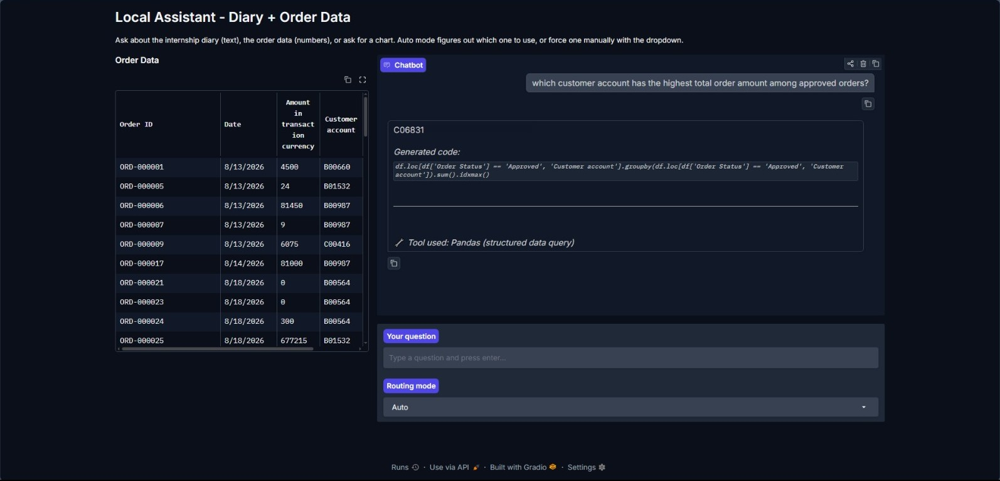
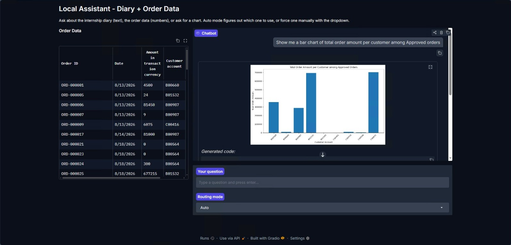
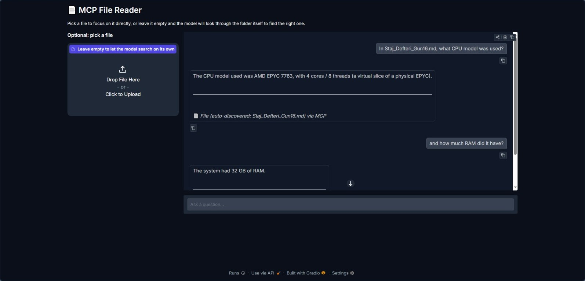

# Local AI RAG MCP Assistant

Local AI experiments built with Ollama, ChromaDB, Gradio, pandas, and MCP.

This repository is a cleaned public version of a learning project. The original work was built step by step through small experiments: first a local chat script, then RAG over notes, then structured data querying, routing, tool calling, and MCP based tools.

## Features

- Local chat with Ollama
- Conversation history for follow up questions
- RAG pipeline with ChromaDB and local embeddings
- Gradio chat interfaces
- Text to pandas querying over sample order data
- Router that chooses between text, data, and chart workflows
- Tool calling experiment with Ollama
- MCP server exposing local tools
- MCP client and Gradio UI experiments

## Why Gradio

Gradio was used because it made the UI side fast and simple for a local AI prototype. The goal of the project was to understand local models, RAG, routing, pandas based querying, and MCP rather than spend time building a custom frontend. Gradio's chat components made it easy to turn terminal experiments into browser based tools and test the behavior quickly.

The demos are intended to run locally. The original experiments did not use Gradio's public sharing option because the project was built around local notes and local data.

## Screenshots

### Router With Pandas Query



### Router With Chart Generation



### MCP File Reader



## Tech Stack

- Python
- Ollama
- Llama 3.1
- Qwen 2.5
- nomic embed text
- ChromaDB
- Gradio
- pandas
- matplotlib
- MCP

## Project Structure

```text
data/
  orders.csv                     Sample order data for pandas based questions
  notes/                         Public sample notes used by the RAG examples
docs/
  learning-summary.md            Clean summary of the learning process
  project-scope.md               Notes about what is included and excluded
screenshots/
  Cropped demo screenshots showing the router, chart generation, and MCP file reader
src/
  01_basic_chat/                 First local chat experiment
  02_rag_pipeline/               RAG ingestion and terminal query scripts
  03_gradio_rag/                 Browser based RAG chat interface
  04_text_to_pandas/             Natural language to pandas experiments
  05_router/                     Router combining text, data, and chart flows
  06_tool_calling/               Basic Ollama tool calling experiment
  07_mcp_server/                 MCP server exposing local tools
  08_mcp_client_ui/              MCP clients and Gradio interfaces
```

## Main Flow

1. Run a local model with Ollama.
2. Store conversation history in the application so follow up questions work.
3. Split sample notes into chunks and store embeddings in ChromaDB.
4. Retrieve relevant chunks for a question and pass them to the model as context.
5. Use pandas for structured order data questions instead of RAG.
6. Route questions to the right workflow: text, data, or chart generation.
7. Test tool calling before moving the same idea into MCP.
8. Expose local workflows as MCP tools.
9. Compare small and larger local models when file discovery and hallucination become visible problems.

## Experiment Timeline

This project was built through small experiments rather than as a single planned application:

1. Basic local chat with Ollama and Llama 3.1.
2. Conversation history after discovering that separate model calls do not remember earlier messages.
3. First RAG pipeline using markdown notes, embeddings, and ChromaDB.
4. Debugging retrieval by printing selected chunks and adding source filenames.
5. Fixed size chunking with overlap after separator based chunking became too dependent on note formatting.
6. Reranking retrieved chunks with the local model to reduce noisy context.
7. Text to pandas for CSV order questions after realizing RAG is not the right tool for structured calculations.
8. Router UI that chooses between RAG, pandas, and chart generation.
9. Function calling experiment to understand how models choose tools and how they can misuse them.
10. MCP server and client experiments, including persistent sessions for better performance.
11. File reading and file discovery experiments through MCP tools.
12. Qwen 2.5 14B test after Llama 3.1 8B hallucinated or selected the wrong file in some multi step flows.

## Safety Notes

Some scripts intentionally execute model generated pandas or matplotlib code with `eval` or `exec`. This was done as a local learning experiment to understand text to code workflows. It should not be treated as a production safe pattern or exposed to untrusted users.

The MCP file reader is also intended for local experimentation. The original project avoided public Gradio sharing because the early version worked with private notes and local files.

## Setup

Create and activate a virtual environment:

```powershell
python -m venv venv
.\venv\Scripts\Activate.ps1
pip install -r requirements.txt
```

Pull the local models:

```powershell
ollama pull llama3.1
ollama pull nomic-embed-text
```

Qwen 2.5 was also tested as a larger local model during the file discovery experiments:

```powershell
ollama pull qwen2.5:14b
```

Build the local vector database:

```powershell
python src\02_rag_pipeline\ingest.py
```

Run one of the interfaces:

```powershell
python src\03_gradio_rag\app.py
python src\05_router\router_ui.py
python src\08_mcp_client_ui\mcp_ui.py
```

## Notes

The original private internship notes are not included. The repository uses a small public sample notes file to demonstrate the RAG flow without exposing private context.
